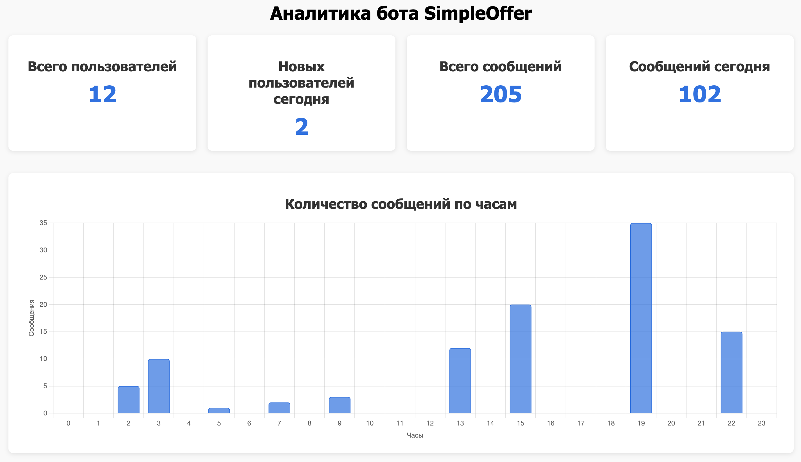

# SimpleOffer: твой личный телеграм-рекрутер
## 🚩 Содержание
- [✨ О проекте](#✨-о-проекте)
- [🌐 Источники вакансий](#🌐-источники-вакансий)
- [📦 Технологии](#📦-технологии)
- [🚀 Установка и запуск](#🚀-установка-и-запуск)
- [👥 Контакты](#👥-контакты)

## ✨ О проекте
### 🚀 Найди идеальную работу без лишних движений!
Забудь про бесконечный поиск работы — [SimpleOffer](https://t.me/simple_offer_bot) сделает всё за тебя! Бот анализирует вакансии с популярных сайтов и присылает только то, что соответствует твоим запросам. Настраивай фильтры и получай актуальные предложения прямо в Telegram!

### 🔥 Почему SimpleOffer?
Больше не нужно тратить часы на просмотр сотен объявлений. Бот находит вакансии по твоим критериям и отправляет их прямо в чат. Удобно, быстро, без лишнего шума!

## 🌐 Источники вакансий

Бот [SimpleOffer](https://t.me/simple_offer_bot) парсит информацию о вакансиях с различных популярных сайтов, чтобы предоставлять пользователям наиболее актуальные и свежие предложения. На данный момент поддерживаются следующие источники:

- **[hh.ru](https://hh.ru/)** — крупнейший российский портал по поиску работы.

В разработке:
- **[superjob.ru](https://www.superjob.ru/)** — популярный сайт для поиска работы и сотрудников.

В будущем планируется добавление других источников для расширения базы вакансий и улучшения качества предложений.

## 📈 Аналитика
В режиме реального времени можно посмотреть небольшую статистику в виде [дэшбоарда](https://nikikorolev.github.io/simple_offer/) по работе бота.



## 📦 Технологии

| Технология | Ссылка | Описание |
|------------|--------|----------|
|  | [Python](https://www.python.org/) | Основной язык программирования |
|  | [Poetry](https://python-poetry.org/) | Управление зависимостями |
|  | [Aiogram](https://docs.aiogram.dev/en/latest/) | Асинхронный фреймворк для работы с Telegram API |
|  | [Alembic](https://alembic.sqlalchemy.org/en/latest/) | Управление миграциями базы данных |
|  | [Loguru](https://loguru.readthedocs.io/en/stable/) | Удобный инструмент для логирования |
|  | [SQLAlchemy](https://www.sqlalchemy.org/) | ORM для работы с базой данных |
|  | [SQLite3](https://www.sqlite.org/index.html) | Основная реляционная база данных |
|  | [Redis](https://redis.io/) | Storage для бота |
|  | [Docker](https://www.docker.com/) | Контейнеризация для удобного развертывания |

## 🚀 Установка и запуск

### 🔐 Настройка SSH-ключа для GitHub
Для корректной работы автоматического пуша аналитики на GitHub Pages необходимо настроить SSH-аутентификацию. Если у вас ещё нет SSH-ключа или вы не добавили его в свой аккаунт GitHub, воспользуйтесь официальными инструкциями: [создание нового SSH-ключа и добавление его в ssh-agent](https://docs.github.com/ru/authentication/connecting-to-github-with-ssh/generating-a-new-ssh-key-and-adding-it-to-the-ssh-agent) и  [добавление SSH-ключа в учетную запись GitHub](https://docs.github.com/ru/authentication/connecting-to-github-with-ssh/adding-a-new-ssh-key-to-your-github-account). Если вам этот функционал не нужен — просто закомментируйте строку в файле bot.py, которая запускает задачу парсинга и пуша, а также все что связно с SSH в docker-файлах.

### 1️⃣ Клонирование репозитория  
Скопируйте репозиторий на свой компьютер:  
```bash
git clone https://github.com/nikikorolev/simple_offer.git
cd simple_offer
```

### 2️⃣ Создание и активация виртуального окружения
```bash
python3 -m venv venv
source venv/bin/activate  # для Windows используйте `venv\Scripts\activate`
```

### 3️⃣ Настройка переменных окружения
Создайте .env файл в корневой директории и укажите в нём настройки:
```env
TOKEN = "YOUR_BOT_TOKEN"
BOT_PORT = YOUR_BOT_PORT
DB_NAME = "db"
REDIS_HOST = "redis"
REDIS_PORT = YOUR_REDIS_PORT
REDIS_DB = 0
# Если нужен пуш аналитики
GIT_BRANCH = "BRANCH_TO_ANALYTICS"
GIT_NICKNAME = "YOUR_GIT_NICKNAME"
GIT_MAIL = "YOUR_GIT_MAIL"
GIT_NAME = "YOUR_GIT_NAME (name + surname)"
REPOSITORY_NAME = "YOUR_REPOSITORY_TO_COMMIT"
```

### 4️⃣ Запуск с помощью Docker
Для удобства работы проект уже настроен для запуска в Docker-контейнере. В директории проекта запусти

```bash
scripts/run.sh
```

## 👥 Контакты
- [Никита Королев](https://t.me/niki_korolev)